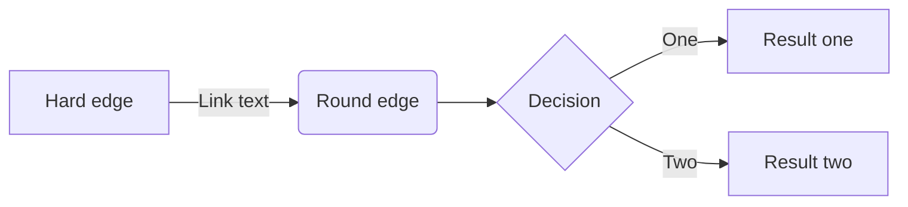
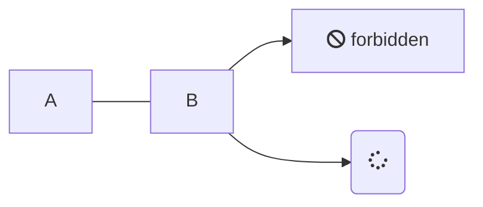
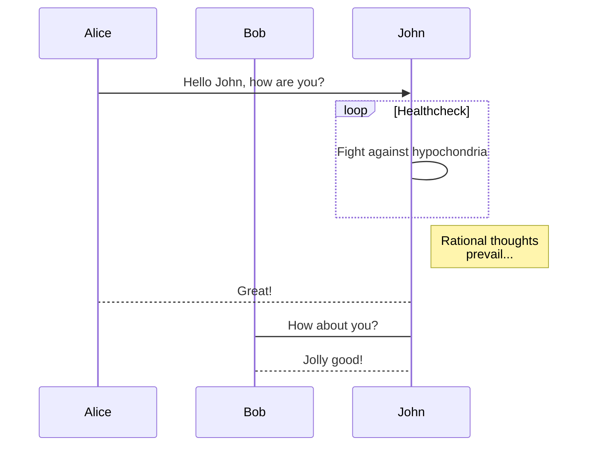

## Admonitions

{}
This is a note.
{}

{}
This is a tip.
{}

{}
This is an informational message.
{}

{}
This is a note.
{}

## Diagrams

### Example 1

```mermaid
graph LR;
  A[Hard edge] -->|Link text| B(Round edge)
    B --> C{Decision}
    C -->|One| D[Result one]
    C -->|Two| E[Result two]
```

### Example 2

```mermaid
  graph LR
      A --- B
      B-->C[fa:fa-ban forbidden]
      B-->D(fa:fa-spinner);
```

### Example 3

```mermaid
sequenceDiagram
    participant Alice
    participant Bob
    Alice->>John: Hello John, how are you?
    loop Healthcheck
        John->John: Fight against hypochondria
    end
    Note right of John: Rational thoughts <br/>prevail...
    John-->Alice: Great!
    John->Bob: How about you?
    Bob-->John: Jolly good!
```

## YouTube

